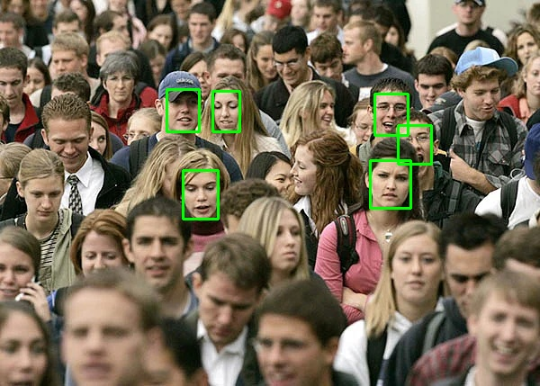

# Face detection 

This project aims at detecting faces on a given image.
The code mostly relies on 1 main librairie : [RetinaFace](https://github.com/ternaus/retinaface) 


## Table of contents
* [Getting started ](#getting-started)
    * [Prerequisites](#prerequisites)
    * [Installation](#installation)
* [Usage](#usage)
* [To do](#to-do)


## Getting started
Code can either be run in a Docker container or in a virtual environment.Both the Dockerfile and docker-compose.yaml files are provided in this repo. 
Please make sure you have your own jupyter config file if your want to run & test this code on a Jupyter notebook. 
### Prerequisities
### Installation
Clone the repo first : 
```
git clone 
```
and 
```
cd /FaceBlur
```
The weight file used in RetinaFace is located [here](https://drive.google.com/drive/folders/1oZRSG0ZegbVkVwUd8wUIQx8W7yfZ_ki1) 

From there, two options are available. 
* With a virtual environment:
```python 
python3 -m venv venv_faceDetection
source venv_faceDetection/bin/activate
pip install -r requirements.txt


```
Make sure that your Pytorch version (>=1.6.0) with CUDA drivers >= 10.1: 
```

* With Docker:
```
docker-compose build
```
Two services have been implemented, one with a Jupyter Notebook 
```
docker-compose up --detach jupyterlab
```
and another basic container: 
```
docker-compose up --detach faceDdetection
```

## Usage 
The algorithm used for face detection (RetinaFace) is a pre-trained model. 
The project is quite resilient regarding the type of inputs which are passed. It can be either a single image or a path to a folder containing images to process. Code can be direclty run from the root path of the project directory. 

The default confidence minimum threshold to detect a face is set to _0.8_. 

### Through command line 
There are at least two main arguments which required to be feed in order to properly run this code : 
* -i (--input) : the input folder/image which has to be processed
* -g (--gpu) : cpu if False, otherwise will try to target the best GPU available.

```
python -m face.main -i data/imgs -g True 
```
A  `.json` file is going to be produced and could be found in the  `./results/` folder as soon as the flag `--verbose` is set to _1_. Such dictionnary contains the main informations regarding the image(s) which was (were) processed : image size, prediction confidence score and raw faces coordinates for each detected faces. In addition to this `.json` file, a copy of the processed images with the 2D bouding boxes can also be generated in `./results/2DBBplot/`.

